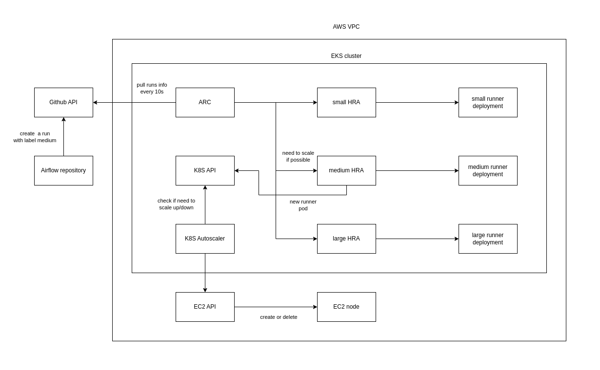

 .. Licensed to the Apache Software Foundation (ASF) under one
    or more contributor license agreements.  See the NOTICE file
    distributed with this work for additional information
    regarding copyright ownership.  The ASF licenses this file
    to you under the Apache License, Version 2.0 (the
    "License"); you may not use this file except in compliance
    with the License.  You may obtain a copy of the License at

 ..   http://www.apache.org/licenses/LICENSE-2.0

 .. Unless required by applicable law or agreed to in writing,
    software distributed under the License is distributed on an
    "AS IS" BASIS, WITHOUT WARRANTIES OR CONDITIONS OF ANY
    KIND, either express or implied.  See the License for the
    specific language governing permissions and limitations
    under the License.

CI Infrastructure for Apache Airflow
====================================

Apache Airflow uses Github Actions as its Continuous Integration (CI) tool. When Airflow contributors open a pull
request, Github Actions runs a series of tests on Apache organization runners. However, due to the limited resources
of these runners, the tests could take a significant amount of time, sometimes up to 2 hours. To improve efficiency
for active committers, a separate set of runners is available for them. These CI runs are executed on self-hosted
runners deployed on an Amazon Elastic Kubernetes Service (EKS) cluster.

This repository contains the necessary scripts and configuration files for managing the CI infrastructure
of Apache Airflow.

.. _aws_configuration:

Access to the AWS Account
-------------------------
Access to the AWS account is primarily restricted to the PMC members. However, as a committer, you can request access
to the account if you believe it is necessary for your contributions. To request access, please inquire on the
`#internal-airflow-ci-cd`_ Slack channel.

.. _#internal-airflow-ci-cd: https://apache-airflow.slack.com/archives/C015SLQF059

Once you have access to the AWS account, you can use the `awscli`_ to interact with the account. To configure the CLI,
you need to follow the steps below:

1. Get your `AWS access key ID`_ and secret access key from the AWS IAM console.

2. Run `aws configure` and enter the credentials when prompted::

       aws configure --profile airflow

   You will be asked to provide the access and secret keys, the region, and the output format.
   For the region, you should choose `us-east-2`, and for the output format, you could skip it to use the default value.

3. Update kubeconfig to access the EKS cluster::

       AWS_PROFILE=airflow aws eks --region us-east-2 update-kubeconfig --name airflow

   This command will update the kubeconfig file located at `~/.kube/config` to include the EKS cluster.
   You can verify that the cluster is added by running `kubectl get nodes`.

.. _awscli: https://aws.amazon.com/cli/
.. _AWS access key ID: https://docs.aws.amazon.com/powershell/latest/userguide/pstools-appendix-sign-up.html

Airflow CI infrastructure architecture
--------------------------------------

Manage the infrastructure resources
~~~~~~~~~~~~~~~~~~~~~~~~~~~~~~~~~~~

We use Terraform to manage the EKS cluster and other AWS resources, and Helm (with helmfile) to manage the
Kubernetes resources inside the cluster.

For Terraform, you can find the detailed documentation here: `Terraform Documentation <terraform/README.rst>`_

And for Helm, you mainly need two commands:

.. code-block:: bash

   # diff the helmfiles to compare the current state with the desired state
   helmfile -f helm diff

   # apply the helmfiles to deploy the desired state
   helmfile -f helm apply

For Docker, we build a custom image for the runners, based on the official `Dockerfiles`_ provided by Github, but
with the `Airflow runner release`_ managed by `Ash`_ instead of the official one, and with python installed on the image
(check `setup-python issue`_ for more details).

To build docker image, you can run the following command:

.. code-block:: bash

    export TARGETPLATFORM=linux/arm64
    export AIRFLOW_RUNNER_VERSION=2.304.0-airflow8
    docker build --platform $TARGETPLATFORM \
        --build-arg AIRFLOW_RUNNER_VERSION=$AIRFLOW_RUNNER_VERSION \
        -t public.ecr.aws/u9s5q9f7/airflow-gha-runner:$AIRFLOW_RUNNER_VERSION \
        runner --push

.. _Dockerfiles: https://github.com/actions/actions-runner-controller/tree/master/runner

.. _Airflow runner release: https://github.com/ashb/runner/tree/v2.304.0-airflow8

.. _Ash: https://github.com/ashb

.. _setup-python issue: https://github.com/actions/setup-python/issues/705

Some important notes
~~~~~~~~~~~~~~~~~~~~

There are some configuration parameters that you need to be aware of:

- EKS node group instance type:
    In our current architecture, we use different types of runners, and each set of runners is configured via a
    RunnerDeployment. Instead of setting container resources, we define the node selectors to schedule the
    runner pod on a specific node group, and we add an anti-affinity to ensure the pod uses all the node resources
    without sharing them with other runners. In this case, we need to carefully choose the instance types because they
    represent the runners' resources.

- ARC sync period:
    The ARC sync period is the duration in which the controller reconciles the desired runners count. Increasing
    this period could lead to a delay in the runners count update (more time in the queue when needing a scale-up
    and a waste of resources when needing a scale-down). Decreasing it could lead to a high load on the Github API.

- Autoscaler conf:
    Similar to the ARC sync period, the autoscaler `scan-interval` is the duration in which the autoscaler checks the
    cluster resources and scales up or down the cluster. Additionally, two other important parameters are
    `scale-down-unneeded-time` and `scale-down-delay-after-add`, which control the delay before taking the scale-down
    decision when the node is underutilized and the delay of checking the scaling-down necessity after a scale-up
    decision.

- HorizontalRunnerAutoscaler scaleDownDelaySecondsAfterScaleOut:
    This parameter represents the delay before the HorizontalRunnerAutoscaler (HRA) takes the scale-down decision after
    adding a new runner. Currently, we use a small delay (30 seconds) because the K8S autoscaler waits for 5 minutes
    before deleting the node. So, if we need a runner, the HRA will add a new one, and it will be scheduled in less
    than 20 seconds.
